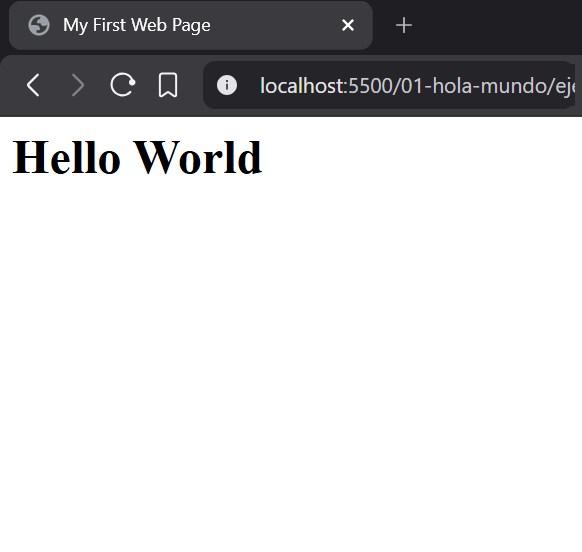
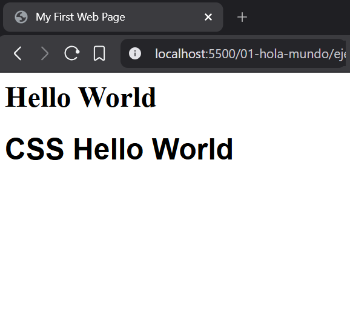
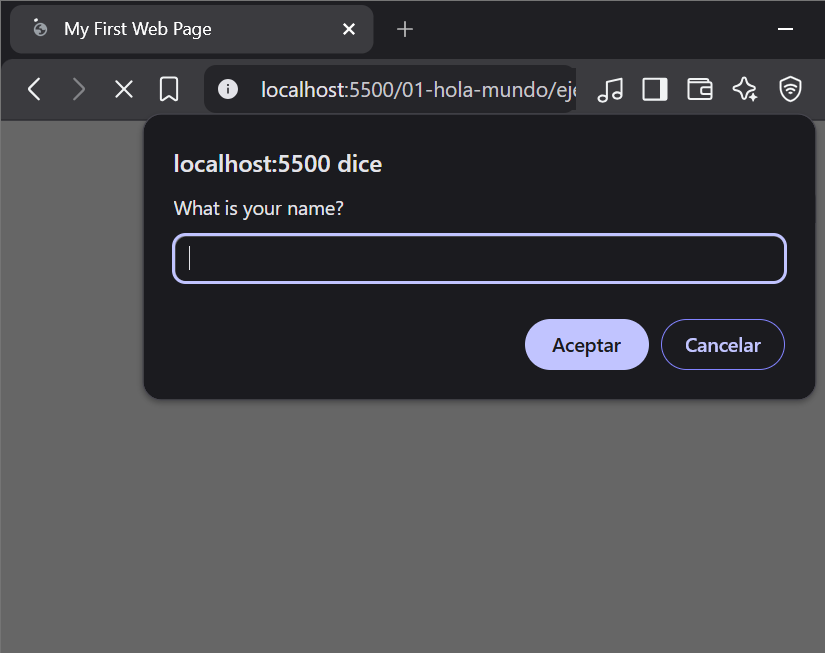

# Hello World

"Hello World" is a traditional first program that beginners write when learning a new programming language. It serves as a simple introduction to verify that your development environment is set up correctly and that you can successfully run code. 

## Index
1. [First HTML File](#1-first-html-file)
   - [1.1 Creating your file: `index.html`](#11-creating-your-file-indexhtml)
   - [1.2 The Root Container: `<html>`](#12-the-root-container-html)
   - [1.3 The Brain (Header): `<head>` & `<title>`](#13-the-brain-header-head--title)
   - [1.4 The Body and Title: `<body>` & `<h1>`](#14-the-body-and-title-body--h1)
   - [1.5 The Result](#15-the-result)
2. [First CSS Style](#2-first-css-style)
   - [2.1 The Heading ID](#21-the-heading-id)
   - [2.2 The Style Tag](#22-the-style-tag)
   - [2.3 Helvetica Font](#23-helvetica-font)
   - [2.4 The Result](#24-the-result)
3. [First JS Script](#3-first-js-script)
   - [3.1 The Script Tag](#31-the-script-tag)
   - [3.2 Asking for your name: `prompt()`](#32-asking-for-your-name-prompt)
   - [3.3 Displaying a greeting: `alert()`](#33-displaying-a-greeting-alert)
   - [3.4 The Result](#34-the-result)

## 1. First HTML File
Let's build a simple web page from scratch by adding elements one by one.

### 1.1 Creating your file: `index.html`
Before writing code, we need a file to put it in. We usually name our main file `index.html`. This is a common practice because web servers automatically look for a file named "index" when someone visits a web address.

### 1.2 The Root Container: `<html>`
Every HTML page starts with the `<html>` tag. This tells the browser that everything inside is HTML.

```html
<html>
</html>
```

### 1.3 The Brain (Header): `<head>` & `<title>`
The `<head>` section is like the "brain" of the page. It contains information that isn't shown directly on the page, like the `<title>` which appears in your browser tab.

```html
<html>
  <head>
    <title>My First Web Page</title>
  </head>
</html>
```

### 1.4 The Body and Title: `<body>` & `<h1>`
The `<body>` tag is where all the visible content of your page lives. We use an `<h1>` tag inside the body to create a large, important title for our page.

```html
<html>
  <head>
    <title>My First Web Page</title>
  </head>
  <body>
    <h1>Hello World</h1>
  </body>
</html>
```

### 1.5 The Result
When you open your `index.html` file in a browser, this is what you should see:



## 2. First CSS Style
Now that we have a structure, let's learn how to style our elements using CSS.

### 2.1 The Heading ID
To style a specific element, we can give it a unique name called an `id`. This allows us to target just that element without affecting others.

```html
<html>
  <head>
    <title>My First Web Page</title>
  </head>
  <body>
    <h1>Hello World</h1>
    <h1 id="styled-title">CSS Hello World</h1>
  </body>
</html>
```

### 2.2 The Style Tag
To write CSS, we use a `<style>` tag inside the `<head>`. We use the `#` symbol followed by the ID name to create a **selector**.

```html
<html>
  <head>
    <title>My First Web Page</title>
    <style>
      #styled-title {
      }
    </style>
  </head>
  <body>
    <h1>Hello World</h1>
    <h1 id="styled-title">CSS Hello World</h1>
  </body>
</html>
```

### 2.3 Helvetica Font
Now we add a **property** and a **value** inside the curly braces. Let's change the `font-family` to `Helvetica` to make it look cleaner.

```html
<html>
  <head>
    <title>My First Web Page</title>
    <style>
      #styled-title {
        font-family: Helvetica;
      }
    </style>
  </head>
  <body>
    <h1>Hello World</h1>
    <h1 id="styled-title">CSS Hello World</h1>
  </body>
</html>
```

### 2.4 The Result
Your second heading should now appear in a clean, sans-serif font (Helvetica), while the first one stays in the browser's default font.



## 3. First JS Script
JavaScript is "the brain" that adds interactivity to your page. It allows your website to think, ask questions, and react to actions.

### 3.1 The Script Tag
To write JavaScript, we use the `<script>` tag. Just like CSS goes inside `<style>`, JavaScript goes inside `<script>`. We usually put it before the closing `</body>` tag so the rest of the page loads first.

```html
<html>
  <head>
    <title>My First Web Page</title>
    <style>
      #styled-title {
        font-family: Helvetica;
      }
    </style>
  </head>
  <body>
    <h1>Hello World</h1>
    <h1 id="styled-title">CSS Hello World</h1>
    <script>
    </script>
  </body>
</html>
```

### 3.2 Asking for your name: `prompt()`
The `prompt()` function is a simple way to ask the user for information. When the browser runs this, it shows a small window with a text box.

```html
<html>
  <head>
    <title>My First Web Page</title>
    <style>
      #styled-title {
        font-family: Helvetica;
      }
    </style>
  </head>
  <body>
    <h1>Hello World</h1>
    <h1 id="styled-title">CSS Hello World</h1>
    <script>
      prompt("What is your name?");
    </script>
  </body>
</html>
```

### 3.3 Displaying a greeting: `alert()`
The `alert()` function shows a simple message to the user. We can use it to say hello after they tell us their name.

```html
<html>
  <head>
    <title>My First Web Page</title>
    <style>
      #styled-title {
        font-family: Helvetica;
      }
    </style>
  </head>
  <body>
    <h1>Hello World</h1>
    <h1 id="styled-title">CSS Hello World</h1>
    <script>
      let name = prompt("What is your name?");
      alert("Hello " + name + "!");
    </script>
  </body>
</html>
```

### 3.4 The Result
When you refresh the page, you'll see a prompt asking for your name, and then an alert greeting you!


