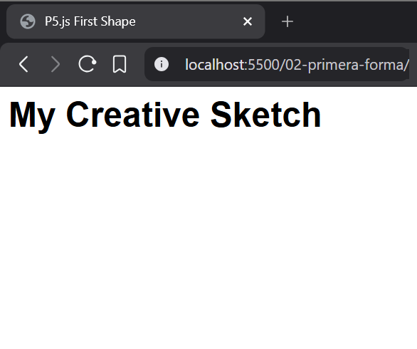
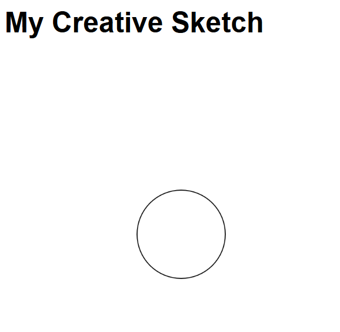
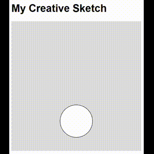
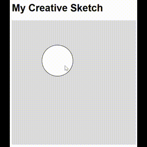

# Primera forma en p5.js

p5.js es una librería de JavaScript enfocada en el **creative coding**, diseñada para que programar sea accesible para artistas, diseñadores y principiantes. Basada en los principios de Processing, p5.js te permite crear gráficos interactivos, animaciones y sonido directamente en el navegador de una forma sencilla y visual.

## Index
1. [First HTML Template](#1-first-html-template)
   - [1.1 The Container: `<html>`](#11-the-container-html)
   - [1.2 The Brain: `<head>` & `<title>`](#12-the-brain-head--title)
   - [1.3 The Content: `<body>` & `<h1>`](#13-the-content-body--h1)
   - [1.4 The Style: `<style>` & Helvetica](#14-the-style-style--helvetica)
   - [1.5 The Result](#15-the-result)
2. [First p5.js Sketch](#2-first-p5-js-sketch)
   - [2.1 The p5.js Library: `script`](#21-the-p5js-library-script)
   - [2.2 Setting up the Canvas: `setup()`](#22-setting-up-the-canvas-setup)
   - [2.3 Drawing a Shape: `circle()`](#23-drawing-a-shape-circle)
   - [2.4 The Result](#24-the-result)
3. [First Movement](#3-first-movement)
   - [3.1 The Variable: `y`](#31-the-variable-y)
   - [3.2 The Engine: `draw()`](#32-the-engine-draw)
   - [3.3 Moving Upwards: Linear Movement](#33-moving-upwards-linear-movement)
   - [3.4 The Top Boundary: `if`](#34-the-top-boundary-if)
   - [3.5 Reversing Direction: `speed`](#35-reversing-direction-speed)
   - [3.6 The Bottom Boundary](#36-the-bottom-boundary)
   - [3.7 The Result](#37-the-result)
4. [Interacting with Mouse](#4-interacting-with-mouse)
   - [4.1 The Vertical Mouse: `mouseY`](#41-the-vertical-mouse-mousey)
   - [4.2 The Horizontal Mouse: `mouseX`](#42-the-horizontal-mouse-mousex)
   - [4.3 The Result](#43-the-result)

## 1. Primera plantilla HTML
Antes de empezar a dibujar con p5.js, necesitamos una base sólida. Vamos a construir un archivo HTML mínimo que servirá como base para nuestro código creativo.

### 1.1 El contenedor: `<html>`
Toda página web empieza con el **tag** `<html>`. Es el contenedor **root** que guarda todo lo demás.

```html
<html>
</html>
```

### 1.2 El cerebro: `<head>` & `<title>`
La sección `<head>` es el "cerebro" de nuestra página. Contiene metadatos e instrucciones para el navegador, como el título que aparece arriba en la pestaña.

```html
<html>
  <head>
    <title>P5.js First Shape</title>
  </head>
</html>
```

### 1.3 El contenido: `<body>` & `<h1>`
El `<body>` es donde vive toda la parte visible de nuestra página. Agregaremos un **tag** `<h1>` para darle un título a nuestro proyecto.

```html
<html>
  <head>
    <title>P5.js First Shape</title>
  </head>
  <body>
    <h1>My Creative Sketch</h1>
  </body>
</html>
```

### 1.4 El estilo: `<style>` & Helvetica
Para que nuestra página se vea profesional, vamos a meterle algo de CSS. Usaremos un **tag** `<style>` para cambiar la tipografía de todo el **body** a Helvetica.

```html
<html>
  <head>
    <title>P5.js First Shape</title>
    <style>
      body {
        font-family: Helvetica, sans-serif;
      }
    </style>
  </head>
  <body>
    <h1>My Creative Sketch</h1>
  </body>
</html>
```

### 1.5 El resultado
Cuando abras este archivo, deberías ver tu título con una tipografía Helvetica limpia. ¡Este es nuestro lienzo vacío, listo para p5.js!



## 2. Primer sketch en p5.js
Ahora que ya tenemos nuestra plantilla, es hora de darle vida con p5.js. Vamos a agregar la librería y a escribir nuestro primer código creativo.

### 2.1 La librería p5.js: `script`
Para usar p5.js, tenemos que decirle a nuestro navegador dónde encontrarla. Vamos a agregar un **tag** `<script>` en el `<head>` que conecte con la librería de p5.js.

```html
<html>
  <head>
    <title>P5.js First Shape</title>
    <style>
      body {
        font-family: Helvetica, sans-serif;
      }
    </style>
    <script src="https://cdn.jsdelivr.net/npm/p5@1.11.13/lib/p5.min.js"></script>
  </head>
  <body>
    <h1>My Creative Sketch</h1>
  </body>
</html>
```

### 2.2 Configurando el Canvas: `setup()`
En p5.js, la función `setup()` se ejecuta una sola vez en cuanto el programa arranca. Es el lugar perfecto para crear nuestra área de dibujo, llamada "canvas". Lo haremos un cuadrado de 400x400.

```html
<html>
  <head>
    <title>P5.js First Shape</title>
    <style>
      body {
        font-family: Helvetica, sans-serif;
      }
    </style>
    <script src="https://cdn.jsdelivr.net/npm/p5@1.11.13/lib/p5.min.js"></script>
    <script>
      function setup() {
        createCanvas(400, 400);
      }
    </script>
  </head>
  <body>
    <h1>My Creative Sketch</h1>
  </body>
</html>
```

### 2.3 Dibujando una forma: `circle()`
Ahora viene la magia. Usaremos la función `circle()` dentro de `setup()` para dibujar una forma. Recibe tres números: la posición en x, la posición en y, y el diámetro.

```html
<html>
  <head>
    <title>P5.js First Shape</title>
    <style>
      body {
        font-family: Helvetica, sans-serif;
      }
    </style>
    <script src="https://cdn.jsdelivr.net/npm/p5@1.11.13/lib/p5.min.js"></script>
    <script>
      function setup() {
        createCanvas(400, 400);
        circle(200, 200, 100);
      }
    </script>
  </head>
  <body>
    <h1>My Creative Sketch</h1>
  </body>
</html>
```

### 2.4 El resultado
¡Felicidades! Acabas de escribir tu primer sketch en p5.js. Deberías ver un canvas cuadrado con un círculo justo en el centro.



## 3. Primer movimiento
Mover una forma es como hacer un flipbook. Necesitamos recordar dónde está nuestra forma e ir cambiando ligeramente esa posición cada vez que la página "pasa".

### 3.1 La variable: `y`
Para recordar la posición de nuestro círculo, crearemos una **variable** llamada `y`. Esta variable guardará la posición vertical de nuestra forma. La definiremos al principio de todo, fuera de cualquier función.

```html
<html>
  <head>
    <title>P5.js First Shape</title>
    <style>
      body {
        font-family: Helvetica, sans-serif;
      }
    </style>
    <script src="https://cdn.jsdelivr.net/npm/p5@1.11.13/lib/p5.min.js"></script>
    <script>
      let y = 200;

      function setup() {
        createCanvas(400, 400);
      }
    </script>
  </head>
  <body>
    <h1>My Creative Sketch</h1>
  </body>
</html>
```

### 3.2 El motor: `draw()`
p5.js tiene una función especial llamada `draw()`. Mientras que `setup()` corre solo una vez, ¡`draw()` se ejecuta 60 veces por segundo! Aquí es donde ponemos todo lo que necesite moverse. También agregaremos `background(220)` para limpiar el canvas cada frame; si no lo hacemos, el movimiento dejará un rastro como si fuera un pincel.

```html
<html>
  <head>
    <title>P5.js First Shape</title>
    <style>
      body {
        font-family: Helvetica, sans-serif;
      }
    </style>
    <script src="https://cdn.jsdelivr.net/npm/p5@1.11.13/lib/p5.min.js"></script>
    <script>
      let y = 200;

      function setup() {
        createCanvas(400, 400);
      }

      function draw() {
        background(220);
        circle(200, y, 100);
      }
    </script>
  </head>
  <body>
    <h1>My Creative Sketch</h1>
  </body>
</html>
```

### 3.3 Moviendo hacia arriba: Movimiento lineal
Para hacer que el círculo se mueva, tenemos que cambiar el valor de `y` dentro de `draw()`. Como la parte superior del canvas es `0`, al restar valor a `y` el círculo se moverá hacia arriba.

```html
<html>
  <head>
    <title>P5.js First Shape</title>
    <style>
      body {
        font-family: Helvetica, sans-serif;
      }
    </style>
    <script src="https://cdn.jsdelivr.net/npm/p5@1.11.13/lib/p5.min.js"></script>
    <script>
      let y = 200;

      function setup() {
        createCanvas(400, 400);
      }

      function draw() {
        background(220);
        circle(200, y, 100);
        
        y = y - 2;
      }
    </script>
  </head>
  <body>
    <h1>My Creative Sketch</h1>
  </body>
</html>
```

### 3.4 El límite superior: `if`
Ahora mismo, el círculo desaparece por arriba de la pantalla. Podemos usar un `if` para chequear si llegó al borde. Si `y` es menor a `0`, lo reseteamos al fondo (`400`) para crear un loop infinito.

```html
<html>
  <head>
    <title>P5.js First Shape</title>
    <style>
      body {
        font-family: Helvetica, sans-serif;
      }
    </style>
    <script src="https://cdn.jsdelivr.net/npm/p5@1.11.13/lib/p5.min.js"></script>
    <script>
      let y = 200;

      function setup() {
        createCanvas(400, 400);
      }

      function draw() {
        background(220);
        circle(200, y, 100);
        
        y = y - 2;

        if (y < 0) {
          y = 400;
        }
      }
    </script>
  </head>
  <body>
    <h1>My Creative Sketch</h1>
  </body>
</html>
```

### 3.5 Cambiando de dirección: `speed`
En lugar de teletransportarlo, vamos a hacer que rebote. Agregaremos otra variable llamada `speed`. Ahora, en vez de escribir `y = y - 2`, usaremos `y = y + speed`. ¡Si tocamos el tope, multiplicamos `speed` por `-1` para invertir la dirección!

```html
<html>
  <head>
    <title>P5.js First Shape</title>
    <style>
      body {
        font-family: Helvetica, sans-serif;
      }
    </style>
    <script src="https://cdn.jsdelivr.net/npm/p5@1.11.13/lib/p5.min.js"></script>
    <script>
      let y = 200;
      let speed = -2;

      function setup() {
        createCanvas(400, 400);
      }

      function draw() {
        background(220);
        circle(200, y, 100);
        
        y = y + speed;

        if (y < 0) {
          speed = speed * -1;
        }
      }
    </script>
  </head>
  <body>
    <h1>My Creative Sketch</h1>
  </body>
</html>
```

### 3.6 El límite inferior
Por último, queremos que también rebote abajo. Agregaremos otra condición a nuestro `if`: si `y` es mayor a `400`, invertiremos la dirección una vez más.

```html
<html>
  <head>
    <title>P5.js First Shape</title>
    <style>
      body {
        font-family: Helvetica, sans-serif;
      }
    </style>
    <script src="https://cdn.jsdelivr.net/npm/p5@1.11.13/lib/p5.min.js"></script>
    <script>
      let y = 200;
      let speed = -2;

      function setup() {
        createCanvas(400, 400);
      }

      function draw() {
        background(220);
        circle(200, y, 100);
        
        y = y + speed;

        if (y < 0) {
          speed = speed * -1;
        }

        if (y > 400) {
          speed = speed * -1;
        }
      }
    </script>
  </head>
  <body>
    <h1>My Creative Sketch</h1>
  </body>
</html>
```

### 3.7 El resultado
¡Ahora ya tienes un sketch dinámico! El círculo se mueve fluidamente de arriba abajo, rebotando cada vez que toca un límite. Este juego entre variables, lógica (`if`) y el loop de `draw()` es la esencia de la animación.



## 4. Interactuando con el mouse
Hasta ahora, nuestro círculo se movía por su cuenta. Ahora vamos a darle el control al usuario por medio de las coordenadas del mouse. p5.js nos da variables especiales que siguen la posición del puntero automáticamente.

### 4.1 El mouse vertical: `mouseY`
En lugar de usar la variable `speed` para mover el círculo, vamos a usar `mouseY`. Esta variable guarda la posición vertical actual del mouse. Aunque ahora el mouse tenga el control, ¡mantendremos la lógica de límites de la sección anterior para asegurarnos de que el círculo no se escape de nuestro canvas!

```html
<html>
  <head>
    <title>P5.js First Shape</title>
    <style>
      body {
        font-family: Helvetica, sans-serif;
      }
    </style>
    <script src="https://cdn.jsdelivr.net/npm/p5@1.11.13/lib/p5.min.js"></script>
    <script>
      let y = 200;

      function setup() {
        createCanvas(400, 400);
      }

      function draw() {
        background(220);
        
        y = mouseY;

        // Keeping the boundaries from Section 3
        if (y < 0) {
          y = 0;
        }

        if (y > 400) {
          y = 400;
        }

        circle(200, y, 100);
      }
    </script>
  </head>
  <body>
    <h1>My Creative Sketch</h1>
  </body>
</html>
```

### 4.2 El mouse horizontal: `mouseX`
Ahora vamos a sumar control horizontal. Crearemos una variable `x` y le daremos el valor de `mouseX`. También le pondremos límites a `x` para que el círculo no se salga de nuestra área de 400x400. ¡Ahora el círculo va a seguir tu cursor por todo el canvas!

```html
<html>
  <head>
    <title>P5.js First Shape</title>
    <style>
      body {
        font-family: Helvetica, sans-serif;
      }
    </style>
    <script src="https://cdn.jsdelivr.net/npm/p5@1.11.13/lib/p5.min.js"></script>
    <script>
      let x = 200;
      let y = 200;

      function setup() {
        createCanvas(400, 400);
      }

      function draw() {
        background(220);
        
        x = mouseX;
        y = mouseY;

        // Vertical Boundaries
        if (y < 0) {
          y = 0;
        }
        if (y > 400) {
          y = 400;
        }

        // Horizontal Boundaries
        if (x < 0) {
          x = 0;
        }
        if (x > 400) {
          x = 400;
        }

        circle(x, y, 100);
      }
    </script>
  </head>
  <body>
    <h1>My Creative Sketch</h1>
  </body>
</html>
```

### 4.3 El resultado
¡Tu sketch ahora es interactivo! El círculo sigue los movimientos de tu mouse en tiempo real. Esta es la base para crear animaciones y juegos interactivos.


