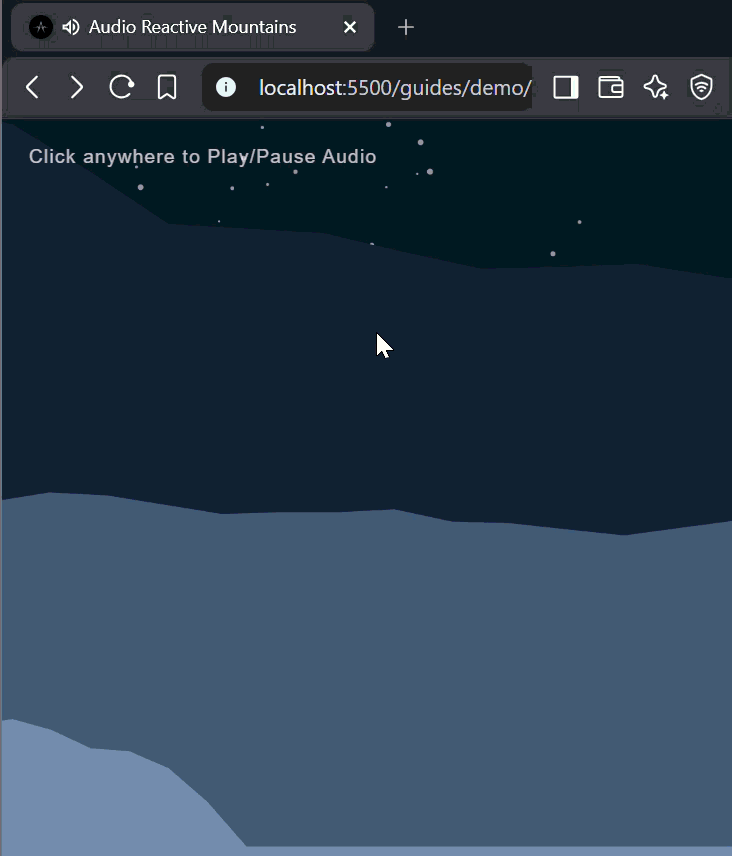

# Audio en p5.js

p5.js proporciona herramientas para capturar y analizar sonido. En esta guía aprenderemos cómo acceder al micrófono, leer niveles de volumen y usar esos valores para crear visuales reactivos al audio directamente en el navegador.

- [1. Estructura HTML](#1-estructura-html)
  - [1.1 Configuración HTML 5](#11-configuración-html-5)
  - [1.2 Estilo básico y tipografía](#12-estilo-básico-y-tipografía)
  - [1.3 El resultado](#13-el-resultado)
- [2. Configuración de p5.js](#2-configuración-de-p5js)
  - [2.1 Importando las librerías](#21-importando-las-librerías)
  - [2.2 Configuración del Canvas vacío](#22-configuración-del-canvas-vacío)
  - [2.3 El resultado](#23-el-resultado)
- [3. Trabajando con Audio](#3-trabajando-con-audio)
  - [3.1 Variables de audio](#31-variables-de-audio)
  - [3.2 Conectando el micrófono](#32-conectando-el-micrófono)
  - [3.3 El analizador FFT](#33-el-analizador-fft)
  - [3.4 Leyendo el volumen](#34-leyendo-el-volumen)
  - [3.5 Dibujando el sonido](#35-dibujando-el-sonido)
  - [3.6 El resultado](#36-el-resultado)
- [4. Vibe Coding con Antigravity](#4-vibe-coding-con-antigravity)

## 1. Estructura HTML

Antes de empezar a trabajar con audio, necesitamos configurar la estructura básica de nuestra página web. Vamos a crear un contenedor HTML sencillo para nuestro sketch de p5.js.

### 1.1 Configuración HTML 5

Todo documento HTML requiere un andamiaje estándar para funcionar correctamente en el navegador. El snippet `html:5` genera esta estructura automáticamente, dándote los tags necesarios para el tipo de documento, idioma, metadatos y las secciones principales: `<head>` y `<body>`. También agregaremos un encabezado `<h1>` dentro del body.

```html
<!DOCTYPE html>
<html lang="en">
<head>
  <meta charset="UTF-8">
  <meta name="viewport" content="width=device-width, initial-scale=1.0">
  <title>Audio Reactive Sketch</title>
</head>
<body>
  <h1>Audio in p5.js</h1>
</body>
</html>
```

### 1.2 Estilo básico y tipografía

Para que nuestra página se vea limpia, agregaremos reglas CSS dentro del tag `<style>` en el `<head>`. Usaremos la fuente Helvetica para mantener un diseño simple y legible.

```html
<!DOCTYPE html>
<html lang="en">
<head>
  <meta charset="UTF-8">
  <meta name="viewport" content="width=device-width, initial-scale=1.0">
  <title>Audio Reactive Sketch</title>

  <style>
    body {
      font-family: Helvetica, sans-serif;
    }
  </style>
</head>
<body>
  <h1>Audio in p5.js</h1>
</body>
</html>
```

### 1.3 El resultado

Cuando abras este archivo en el navegador, verás una página limpia mostrando el título "Audio in p5.js" con la fuente Helvetica. Esta estructura HTML es la base de nuestro proyecto.


## 2. Configuración de p5.js

### 2.1 Importando las librerías

Para usar p5.js y sus capacidades de audio, necesitamos decirle a nuestro navegador dónde encontrarlas. Vamos a agregar dos tags `<script>` en el `<head>` que conectan con la librería principal de p5.js y el add-on p5.sound.

```html
<!DOCTYPE html>
<html lang="en">
<head>
  <meta charset="UTF-8">
  <meta name="viewport" content="width=device-width, initial-scale=1.0">
  <title>Audio Reactive Sketch</title>

  <style>
    body {
      font-family: Helvetica, sans-serif;
    }
  </style>

  <script src="https://cdn.jsdelivr.net/npm/p5@1.11.13/lib/p5.min.js"></script>
  <script src="https://cdn.jsdelivr.net/npm/p5@1.11.13/lib/addons/p5.sound.min.js"></script>
</head>
<body>
  <h1>Audio in p5.js</h1>
</body>
</html>
```

### 2.2 Configuración del Canvas vacío

Para empezar a dibujar, usamos las funciones `setup()` y `draw()`. `setup()` se ejecuta una sola vez para crear el canvas, y `draw()` se ejecuta continuamente para renderizar los frames. Definiremos variables para `width` y `height` para configurar las dimensiones del canvas, de modo que tengamos un solo lugar donde modificarlas.

```html
<!DOCTYPE html>
<html lang="en">
<head>
  <meta charset="UTF-8">
  <meta name="viewport" content="width=device-width, initial-scale=1.0">
  <title>Audio Reactive Sketch</title>

  <style>
    body {
      font-family: Helvetica, sans-serif;
    }
  </style>

  <script src="https://cdn.jsdelivr.net/npm/p5@1.11.13/lib/p5.min.js"></script>
  <script src="https://cdn.jsdelivr.net/npm/p5@1.11.13/lib/addons/p5.sound.min.js"></script>
</head>
<body>
  <h1>Audio in p5.js</h1>

  <script>
    let width = 400;
    let height = 400;

    function setup() {
      createCanvas(width, height);
    }

    function draw() {
      background(220);
    }
  </script>
</body>
</html>
```

### 2.3 El resultado

Con estas funciones, aparecerá un canvas en la página. La función `setup()` crea el área de dibujo, y `draw()` pinta el color de fondo 60 veces por segundo.


## 3. Trabajando con Audio

### 3.1 Variables de audio

Para trabajar con audio, primero necesitamos declarar variables que almacenen el micrófono y el analizador de audio. Declararemos `mic` y `fft` de forma global para que puedan ser accedidas en todo el código.

```html
<!DOCTYPE html>
<html lang="en">
<head>
  <meta charset="UTF-8">
  <meta name="viewport" content="width=device-width, initial-scale=1.0">
  <title>Audio Reactive Sketch</title>

  <style>
    body {
      font-family: Helvetica, sans-serif;
    }
  </style>

  <script src="https://cdn.jsdelivr.net/npm/p5@1.11.13/lib/p5.min.js"></script>
  <script src="https://cdn.jsdelivr.net/npm/p5@1.11.13/lib/addons/p5.sound.min.js"></script>
</head>
<body>
  <h1>Audio in p5.js</h1>

  <script>
    let width = 400;
    let height = 400;

    let mic;
    let fft;

    function setup() {
      createCanvas(width, height);
    }

    function draw() {
      background(220);
    }
  </script>
</body>
</html>
```

### 3.2 Conectando el micrófono

Dentro de la función `setup()`, inicializamos el objeto micrófono usando `new p5.AudioIn()` y le indicamos que comience a capturar audio con `mic.start()`.

```html
<!DOCTYPE html>
<html lang="en">
<head>
  <meta charset="UTF-8">
  <meta name="viewport" content="width=device-width, initial-scale=1.0">
  <title>Audio Reactive Sketch</title>

  <style>
    body {
      font-family: Helvetica, sans-serif;
    }
  </style>

  <script src="https://cdn.jsdelivr.net/npm/p5@1.11.13/lib/p5.min.js"></script>
  <script src="https://cdn.jsdelivr.net/npm/p5@1.11.13/lib/addons/p5.sound.min.js"></script>
</head>
<body>
  <h1>Audio in p5.js</h1>

  <script>
    let width = 400;
    let height = 400;

    let mic;
    let fft;

    function setup() {
      createCanvas(width, height);
      
      mic = new p5.AudioIn();
      mic.start();
    }

    function draw() {
      background(220);
    }
  </script>
</body>
</html>
```

### 3.3 El analizador FFT

Para procesar el sonido, necesitamos un analizador. Inicializamos un nuevo objeto Fast Fourier Transform (FFT) y le indicamos que use nuestro micrófono como entrada. Esto se hace dentro de la función `setup()`.

```html
<!DOCTYPE html>
<html lang="en">
<head>
  <meta charset="UTF-8">
  <meta name="viewport" content="width=device-width, initial-scale=1.0">
  <title>Audio Reactive Sketch</title>

  <style>
    body {
      font-family: Helvetica, sans-serif;
    }
  </style>

  <script src="https://cdn.jsdelivr.net/npm/p5@1.11.13/lib/p5.min.js"></script>
  <script src="https://cdn.jsdelivr.net/npm/p5@1.11.13/lib/addons/p5.sound.min.js"></script>
</head>
<body>
  <h1>Audio in p5.js</h1>

  <script>
    let width = 400;
    let height = 400;

    let mic;
    let fft;

    function setup() {
      createCanvas(width, height);
      
      mic = new p5.AudioIn();
      mic.start();
      
      fft = new p5.FFT();
      fft.setInput(mic);
    }

    function draw() {
      background(220);
    }
  </script>
</body>
</html>
```

### 3.4 Leyendo el volumen

Dentro de la función `draw()`, ya podemos leer los datos de audio. Le indicamos al analizador FFT que procese el frame de audio actual. Luego, obtenemos el nivel de volumen actual del micrófono y mapeamos ese valor a un rango de tamaño para nuestra forma visual.

```html
<!DOCTYPE html>
<html lang="en">
<head>
  <meta charset="UTF-8">
  <meta name="viewport" content="width=device-width, initial-scale=1.0">
  <title>Audio Reactive Sketch</title>

  <style>
    body {
      font-family: Helvetica, sans-serif;
    }
  </style>

  <script src="https://cdn.jsdelivr.net/npm/p5@1.11.13/lib/p5.min.js"></script>
  <script src="https://cdn.jsdelivr.net/npm/p5@1.11.13/lib/addons/p5.sound.min.js"></script>
</head>
<body>
  <h1>Audio in p5.js</h1>

  <script>
    let width = 400;
    let height = 400;

    let mic;
    let fft;

    function setup() {
      createCanvas(width, height);
      
      mic = new p5.AudioIn();
      mic.start();
      
      fft = new p5.FFT();
      fft.setInput(mic);
    }

    function draw() {
      background(220);
      
      let spectrum = fft.analyze();
      let volume = mic.getLevel();
      
      let size = map(volume, 0, 1, 10, 1200);
    }
  </script>
</body>
</html>
```

### 3.5 Dibujando el sonido

Finalmente, usamos la variable `size` calculada para dibujar una forma dinámica. Establecemos un color magenta vibrante y dibujamos una elipse en el centro del canvas que escala según el volumen.

```html
<!DOCTYPE html>
<html lang="en">
<head>
  <meta charset="UTF-8">
  <meta name="viewport" content="width=device-width, initial-scale=1.0">
  <title>Audio Reactive Sketch</title>

  <style>
    body {
      font-family: Helvetica, sans-serif;
    }
  </style>

  <script src="https://cdn.jsdelivr.net/npm/p5@1.11.13/lib/p5.min.js"></script>
  <script src="https://cdn.jsdelivr.net/npm/p5@1.11.13/lib/addons/p5.sound.min.js"></script>
</head>
<body>
  <h1>Audio in p5.js</h1>

  <script>
    let width = 400;
    let height = 400;

    let mic;
    let fft;

    function setup() {
      createCanvas(width, height);
      
      mic = new p5.AudioIn();
      mic.start();
      
      fft = new p5.FFT();
      fft.setInput(mic);
    }

    function draw() {
      background(220);
      
      let spectrum = fft.analyze();
      let volume = mic.getLevel();
      
      let size = map(volume, 0, 1, 10, 1200);
      
      fill(255, 0, 255);
      ellipse(width / 2, height / 2, size);
    }
  </script>
</body>
</html>
```

### 3.6 El resultado

Cuando ejecutes este código y permitas que el navegador acceda a tu micrófono, verás un círculo magenta que crece y se encoge en tiempo real mientras hablas o haces ruido frente al micrófono.


## 4. Vibe Coding con Antigravity

Para llevar tus visualizaciones de audio al siguiente nivel, puedes usar **Google Antigravity** para "vibe codear" un sketch personalizado.

Primero, descarga un archivo MP3 de la colección [100 Free Royalty Background Music Tracks](https://archive.org/details/100_free_royalty_background_music_tracks) en Internet Archive. Una vez que hayas descargado el MP3 que te guste, colócalo directamente en el mismo directorio que tu sketch.

Luego, ¡usa Google Antigravity para que escriba el código por ti! Puedes pedirle que cree una visualización de audio que reaccione a tu nuevo archivo MP3, describiendo los colores, formas y la estética visual que quieres lograr.

### 4.1 El resultado


