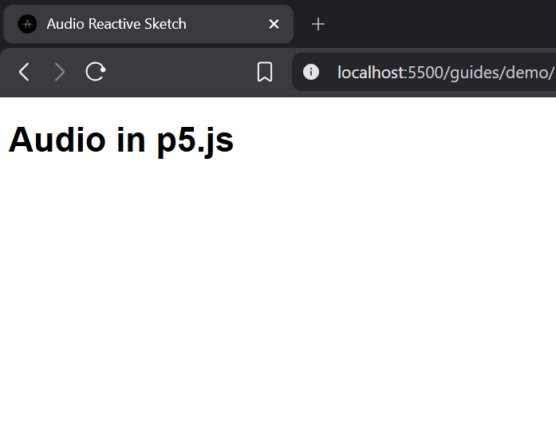
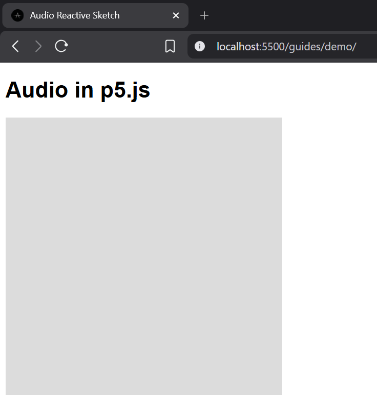
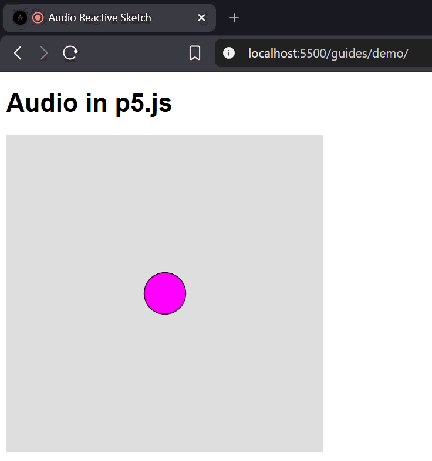

# Audio in p5.js

p5.js provides powerful tools to capture and analyze sound. In this guide, we will learn how to access the microphone, read volume levels, and use those values to create audio-reactive visuals directly in the browser.

- [1. HTML Structure](#1-html-structure)
  - [1.1 HTML 5 Setup](#11-html-5-setup)
  - [1.2 Basic Style and Typography](#12-basic-style-and-typography)
  - [1.3 The Result](#13-the-result)
- [2. p5.js Setup](#2-p5js-setup)
  - [2.1 Importing the Libraries](#21-importing-the-libraries)
  - [2.2 Empty Canvas Setup](#22-empty-canvas-setup)
  - [2.3 The Result](#23-the-result)
- [3. Working with Audio](#3-working-with-audio)
  - [3.1 Audio Variables](#31-audio-variables)
  - [3.2 Connecting the Microphone](#32-connecting-the-microphone)
  - [3.3 The FFT Analyzer](#33-the-fft-analyzer)
  - [3.4 Reading the Volume](#34-reading-the-volume)
  - [3.5 Drawing the Sound](#35-drawing-the-sound)
  - [3.6 The Result](#36-the-result)

## 1. HTML Structure

Before we start working with audio, we need to set up the basic structure of our webpage. We will create a simple HTML container for our p5.js sketch.

### 1.1 HTML 5 Setup

Every HTML document requires standard scaffolding to work correctly in the browser. Using the `html:5` snippet generates this structure automatically, giving you the necessary tags for the document type, language, metadata, and the main sections: `<head>` and `<body>`. We will also add an `<h1>` heading inside the body.

```html
<!DOCTYPE html>
<html lang="en">
<head>
  <meta charset="UTF-8">
  <meta name="viewport" content="width=device-width, initial-scale=1.0">
  <title>Audio Reactive Sketch</title>
</head>
<body>
  <h1>Audio in p5.js</h1>
</body>
</html>
```

### 1.2 Basic Style and Typography

To make our page look clean, we will add CSS rules inside the `<style>` tag within the `<head>`. We will use the Helvetica font for our text to maintain a simple, readable design.

```html
<!DOCTYPE html>
<html lang="en">
<head>
  <meta charset="UTF-8">
  <meta name="viewport" content="width=device-width, initial-scale=1.0">
  <title>Audio Reactive Sketch</title>

  <style>
    body {
      font-family: Helvetica, sans-serif;
    }
  </style>
</head>
<body>
  <h1>Audio in p5.js</h1>
</body>
</html>
```

### 1.3 The Result

When you open this file in your browser, you will see a clean webpage displaying the title "Audio in p5.js" using the Helvetica font. This HTML structure provides the foundation for our project.



## 2. p5.js Setup

### 2.1 Importing the Libraries

To use p5.js and its audio capabilities, we need to tell our browser where to find them. We are going to add two `<script>` tags in the `<head>` that connect to the core p5.js library and the p5.sound add-on.

```html
<!DOCTYPE html>
<html lang="en">
<head>
  <meta charset="UTF-8">
  <meta name="viewport" content="width=device-width, initial-scale=1.0">
  <title>Audio Reactive Sketch</title>

  <style>
    body {
      font-family: Helvetica, sans-serif;
    }
  </style>

  <script src="https://cdn.jsdelivr.net/npm/p5@1.11.13/lib/p5.min.js"></script>
  <script src="https://cdn.jsdelivr.net/npm/p5@1.11.13/lib/addons/p5.sound.min.js"></script>
</head>
<body>
  <h1>Audio in p5.js</h1>
</body>
</html>
```

### 2.2 Empty Canvas Setup

To start drawing, we use the `setup()` and `draw()` functions. `setup()` runs once to create the canvas, and `draw()` runs continuously to render frames. We will define variables for `width` and `height` to configure the canvas dimensions, ensuring we have a single place to modify them.

```html
<!DOCTYPE html>
<html lang="en">
<head>
  <meta charset="UTF-8">
  <meta name="viewport" content="width=device-width, initial-scale=1.0">
  <title>Audio Reactive Sketch</title>

  <style>
    body {
      font-family: Helvetica, sans-serif;
    }
  </style>

  <script src="https://cdn.jsdelivr.net/npm/p5@1.11.13/lib/p5.min.js"></script>
  <script src="https://cdn.jsdelivr.net/npm/p5@1.11.13/lib/addons/p5.sound.min.js"></script>
</head>
<body>
  <h1>Audio in p5.js</h1>

  <script>
    let width = 400;
    let height = 400;

    function setup() {
      createCanvas(width, height);
    }

    function draw() {
      background(220);
    }
  </script>
</body>
</html>
```

### 2.3 The Result

With these functions, a canvas will appear on the page. The `setup()` function creates the drawing area, and `draw()` paints the background color 60 times per second.



## 3. Working with Audio

### 3.1 Audio Variables

To work with audio, we first need to declare variables to store the microphone and the audio analyzer. We will declare `mic` and `fft` globally so they can be accessed throughout the code.

```html
<!DOCTYPE html>
<html lang="en">
<head>
  <meta charset="UTF-8">
  <meta name="viewport" content="width=device-width, initial-scale=1.0">
  <title>Audio Reactive Sketch</title>

  <style>
    body {
      font-family: Helvetica, sans-serif;
    }
  </style>

  <script src="https://cdn.jsdelivr.net/npm/p5@1.11.13/lib/p5.min.js"></script>
  <script src="https://cdn.jsdelivr.net/npm/p5@1.11.13/lib/addons/p5.sound.min.js"></script>
</head>
<body>
  <h1>Audio in p5.js</h1>

  <script>
    let width = 400;
    let height = 400;

    let mic;
    let fft;

    function setup() {
      createCanvas(width, height);
    }

    function draw() {
      background(220);
    }
  </script>
</body>
</html>
```

### 3.2 Connecting the Microphone

Inside the `setup()` function, we initialize the microphone object using `new p5.AudioIn()` and tell it to begin capturing audio with `mic.start()`.

```html
<!DOCTYPE html>
<html lang="en">
<head>
  <meta charset="UTF-8">
  <meta name="viewport" content="width=device-width, initial-scale=1.0">
  <title>Audio Reactive Sketch</title>

  <style>
    body {
      font-family: Helvetica, sans-serif;
    }
  </style>

  <script src="https://cdn.jsdelivr.net/npm/p5@1.11.13/lib/p5.min.js"></script>
  <script src="https://cdn.jsdelivr.net/npm/p5@1.11.13/lib/addons/p5.sound.min.js"></script>
</head>
<body>
  <h1>Audio in p5.js</h1>

  <script>
    let width = 400;
    let height = 400;

    let mic;
    let fft;

    function setup() {
      createCanvas(width, height);
      
      mic = new p5.AudioIn();
      mic.start();
    }

    function draw() {
      background(220);
    }
  </script>
</body>
</html>
```

### 3.3 The FFT Analyzer

To process the sound, we need an analyzer. We initialize a new Fast Fourier Transform (FFT) object and tell it to use our microphone as its input. This is done inside the `setup()` function.

```html
<!DOCTYPE html>
<html lang="en">
<head>
  <meta charset="UTF-8">
  <meta name="viewport" content="width=device-width, initial-scale=1.0">
  <title>Audio Reactive Sketch</title>

  <style>
    body {
      font-family: Helvetica, sans-serif;
    }
  </style>

  <script src="https://cdn.jsdelivr.net/npm/p5@1.11.13/lib/p5.min.js"></script>
  <script src="https://cdn.jsdelivr.net/npm/p5@1.11.13/lib/addons/p5.sound.min.js"></script>
</head>
<body>
  <h1>Audio in p5.js</h1>

  <script>
    let width = 400;
    let height = 400;

    let mic;
    let fft;

    function setup() {
      createCanvas(width, height);
      
      mic = new p5.AudioIn();
      mic.start();
      
      fft = new p5.FFT();
      fft.setInput(mic);
    }

    function draw() {
      background(220);
    }
  </script>
</body>
</html>
```

### 3.4 Reading the Volume

Inside the `draw()` function, we can now read the audio data. We tell the FFT analyzer to process the current audio frame. Then, we get the current volume level from the microphone and map that value to a size range for our visual shape.

```html
<!DOCTYPE html>
<html lang="en">
<head>
  <meta charset="UTF-8">
  <meta name="viewport" content="width=device-width, initial-scale=1.0">
  <title>Audio Reactive Sketch</title>

  <style>
    body {
      font-family: Helvetica, sans-serif;
    }
  </style>

  <script src="https://cdn.jsdelivr.net/npm/p5@1.11.13/lib/p5.min.js"></script>
  <script src="https://cdn.jsdelivr.net/npm/p5@1.11.13/lib/addons/p5.sound.min.js"></script>
</head>
<body>
  <h1>Audio in p5.js</h1>

  <script>
    let width = 400;
    let height = 400;

    let mic;
    let fft;

    function setup() {
      createCanvas(width, height);
      
      mic = new p5.AudioIn();
      mic.start();
      
      fft = new p5.FFT();
      fft.setInput(mic);
    }

    function draw() {
      background(220);
      
      let spectrum = fft.analyze();
      let volume = mic.getLevel();
      
      let size = map(volume, 0, 1, 10, 1200);
    }
  </script>
</body>
</html>
```

### 3.5 Drawing the Sound

Finally, we use the calculated `size` variable to draw a dynamic shape. We set a vibrant magenta color and draw an ellipse in the center of the canvas that scales based on the volume.

```html
<!DOCTYPE html>
<html lang="en">
<head>
  <meta charset="UTF-8">
  <meta name="viewport" content="width=device-width, initial-scale=1.0">
  <title>Audio Reactive Sketch</title>

  <style>
    body {
      font-family: Helvetica, sans-serif;
    }
  </style>

  <script src="https://cdn.jsdelivr.net/npm/p5@1.11.13/lib/p5.min.js"></script>
  <script src="https://cdn.jsdelivr.net/npm/p5@1.11.13/lib/addons/p5.sound.min.js"></script>
</head>
<body>
  <h1>Audio in p5.js</h1>

  <script>
    let width = 400;
    let height = 400;

    let mic;
    let fft;

    function setup() {
      createCanvas(width, height);
      
      mic = new p5.AudioIn();
      mic.start();
      
      fft = new p5.FFT();
      fft.setInput(mic);
    }

    function draw() {
      background(220);
      
      let spectrum = fft.analyze();
      let volume = mic.getLevel();
      
      let size = map(volume, 0, 1, 10, 1200);
      
      fill(255, 0, 255);
      ellipse(width / 2, height / 2, size);
    }
  </script>
</body>
</html>
```

### 3.6 The Result

When you run this code and allow the browser to access your microphone, you will see a magenta circle that grows and shrinks in real-time as you speak or make noise into the microphone.


